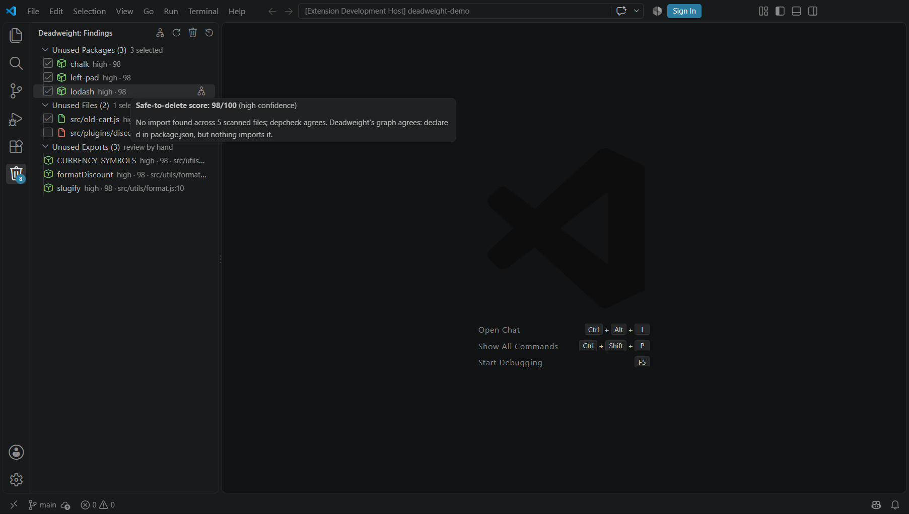
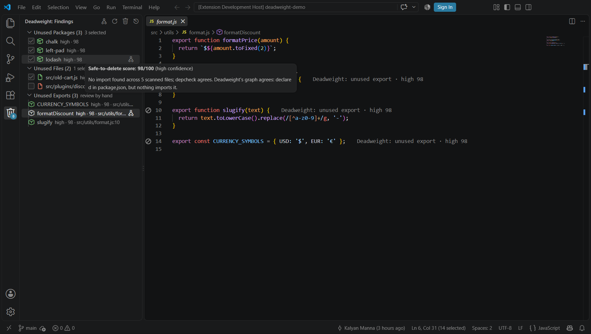
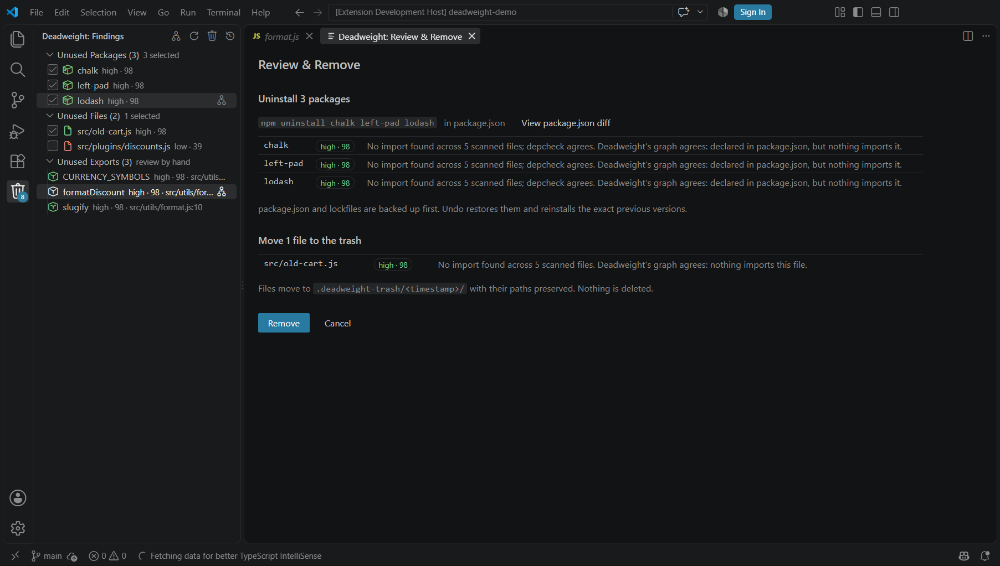
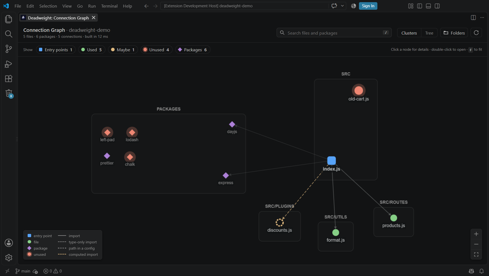
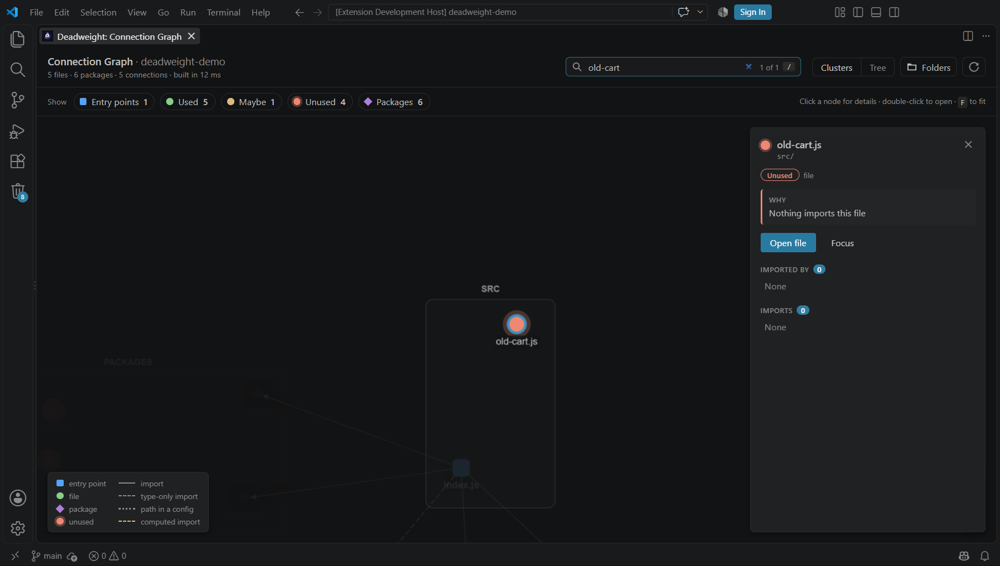

# 💀 Deadweight

> **Your codebase has deadweight. Deadweight finds it.**

[](https://marketplace.visualstudio.com/items?itemName=kalyanmanna.deadweight)
[](https://marketplace.visualstudio.com/items?itemName=kalyanmanna.deadweight)
[](LICENSE)

Deadweight is a VS Code extension that finds **unused dependencies, dead files and unused exports** in JavaScript and TypeScript projects — tells you **how safe each one is to delete** — and removes them **with a preview and one-click undo**.



---

## 📑 Contents

- [The problem](#-the-problem)
- [Quick start (1 minute)](#-quick-start-1-minute)
- [The complete workflow](#-the-complete-workflow)
- [Understanding the safe-to-delete score](#-understanding-the-safe-to-delete-score)
- [The Connection Graph](#-the-connection-graph)
- [Commands & settings](#%EF%B8%8F-commands--settings)
- [Troubleshooting & FAQ](#-troubleshooting--faq)
- [How it works](#-how-it-works)
- [Safety philosophy](#-safety-philosophy)
- [Development](#-development)

---

## 🚨 The Problem

Modern projects accumulate technical clutter surprisingly fast.

You install a package for a feature that gets removed.
You create a utility file that stops being used.
You leave behind dependencies from an old implementation.

Over time, these become **deadweight**: unnecessary dependencies, unused files, larger projects, harder navigation, more maintenance and more technical debt.

Tools that *detect* dead code already exist — but they print a list of 40 paths in a terminal and leave you to double-check every one before daring to delete anything. Most people never act on it.

**Deadweight closes that loop: detect → understand → remove safely → undo if needed.**

---

## ⚡ Quick start (1 minute)

1. **Install** — in VS Code open Extensions (`Ctrl+Shift+X` / `Cmd+Shift+X`), search **Deadweight**, click **Install**.
2. **Open your project** — *File → Open Folder…* and pick the folder that contains your `package.json`.
3. **Click the Deadweight icon** (🗑️) in the left activity bar → **Scan Workspace**.
4. **Read the results** — every item has a score like `high · 98`. Hover it to see why.
5. **Click the trash icon** at the top of the panel → check the preview → **Remove**.
6. Changed your mind? Click **Undo**.

That's it. The rest of this page explains each step in detail.

---

## 🧭 The complete workflow

```text
 Install ─► Open project ─► Scan ─► Read scores ─► Investigate ─► Review & Remove ─► (Undo) ─► Scan again
                              │                        ▲
                              └──► Connection Graph ───┘   (optional: see how everything connects)
```

### Step 1 — Install

- **VS Code:** Extensions view → search **Deadweight** → **Install**, or press `Ctrl+P` and run `ext install kalyanmanna.deadweight`.
- **From a file:** download the `.vsix` from the [GitHub releases](https://github.com/Kalyan-github-4/DeadWeight/releases), then Extensions view → **⋯ → Install from VSIX…**

Installing does nothing on its own — Deadweight never runs in the background or on startup. It only works when you ask.

### Step 2 — Open your project

Open the folder that **directly contains `package.json`** (*File → Open Folder…*).

> 💡 If your project lives in a subfolder — e.g. you opened `my-projects/` but the app is in `my-projects/my-app/` — open `my-app` itself. Otherwise Deadweight will tell you it can't find a `package.json`.

**Tip:** commit your work to git before cleaning up. Then the cleanup shows up as its own, easy-to-review diff.

### Step 3 — Scan

Click the **Deadweight** icon in the activity bar, then **Scan Workspace** (or run **Deadweight: Scan for unused code** from the Command Palette).

- A progress notification appears; you can keep working, or **Cancel** at any time.
- The first scan downloads the analysis engines and can take 30–60 seconds; later scans take a few seconds.
- When it finishes, the panel fills with three groups:

| Group | What it lists | Can Deadweight remove it? |
|---|---|---|
| 📦 **Unused Packages** | Dependencies in `package.json` that nothing imports, runs or configures | ✅ Yes (uninstalls with your package manager) |
| 🗂️ **Unused Files** | Files no entry point can reach | ✅ Yes (moves them to a trash folder) |
| 🧩 **Unused Exports** | Exported functions, classes, constants and types that no file imports | ✋ No — you delete the code yourself |

If nothing is found you'll see **"No deadweight found"** — that's a clean project. 🎉

### Step 4 — Read the scores

Every finding shows a band and a **safe-to-delete score from 0 to 99**:

| Score | Band | Meaning | Pre-checked? |
|---|---|---|---|
| **80–99** | 🟢 high | Independent checks all agree it's unused | ✅ Yes |
| **50–79** | 🟡 medium | Probably unused, but something is worth a look | No |
| **< 50** | 🔴 low | Could be used in a way that can't be proven (dynamic imports, config, plugins…) | No |

**Hover any finding** to read exactly why it got its score — for example *"No import found across 5 scanned files; depcheck agrees. Deadweight's graph agrees: nothing imports it."* See [Understanding the score](#-understanding-the-safe-to-delete-score) for all the rules.

### Step 5 — Investigate

- **Click a finding** to open it: a file opens directly, a package jumps to its line in `package.json`, an export jumps to the exact function.
- **In the editor**, dead files and unused exports are marked with a ⊘ in the gutter and a note like *"Deadweight: unused export · high 98"* at the end of the line. Unused files are also dimmed in the Explorer.



- **Right-click a finding → Show in Connection Graph** to see what it is (or isn't) connected to.

### Step 6 — Review & Remove

1. Tick or untick the checkboxes. High-score packages and files start ticked; medium and low never do.
2. Click the **trash icon** at the top of the Deadweight panel (**Review & Remove**).
3. A preview opens — nothing has changed yet. It shows:
   - the exact uninstall command (e.g. `npm uninstall chalk left-pad lodash`),
   - a **View package.json diff** button,
   - which files will move to `.deadweight-trash/<timestamp>/`,
   - the **checks that will verify the removal** (your type check, `build` and `test` scripts),
   - a warning if you have uncommitted changes.
4. Click **Remove & verify** to go ahead, or **Cancel** to leave everything as it is.



What actually happens:

- **Packages** are uninstalled in one command with your package manager (npm, yarn, pnpm or bun — detected automatically). `package.json` and your lockfile are backed up first.
- **Files** are **moved**, never deleted, into `.deadweight-trash/<timestamp>/` with their folder structure preserved. The trash folder is added to your `.gitignore` automatically.
- **Unused exports** are never touched — open them and delete the code by hand if you agree.

#### 🛡️ Delete a vulnerability

Every unused package shows what removing it really gains: the space it and the dependencies **nothing else needs** take up in `node_modules`, and the **known vulnerabilities** among them (from the npm advisory database, the one `npm audit` uses):

```
lodash     high · 98 · 1.3 MB · ⚠ 5 vulns
minimist   high · 98 · 32 KB  · ⚠ 1 vuln
```

Hover a package for the list of advisories with links. The scan summary and the Review & Remove panel add it up: *"Frees 1.4 MB and removes 6 known vulnerabilities (1 critical, 2 high, 3 moderate)."* Unused code you never run can still be installed, audited against and exploited in your supply chain; removing it is the cheapest fix there is.

The lookup sends the names and versions of the unused packages (and their exclusive dependencies) to `registry.npmjs.org`, like `npm audit` does. Turn it off with `deadweight.checkVulnerabilities`; sizes are measured locally either way.

#### ✅ Verified removal

Static analysis can only guess. Deadweight checks its work with **your project's own checks**:

1. **Before removing**, it runs the ticked checks: your type check (`typecheck` / `check-types` script, or `tsc --noEmit`), `build` and `test`. Checks that already fail are left out, since they can't prove anything.
2. **After removing**, it runs the passing ones again.
3. If one that passed before now fails, the removal is **undone automatically**. Deadweight reads the error output, names the likely cause (e.g. *"Cannot find module 'lodash'"* → `lodash`) and marks it **in use**, so it stays at the bottom of the score in future scans.

When everything still passes you get *"Verified: type check, build and tests still pass"*, plus the usual **Undo**. Untick any check in the panel to skip it (your choice is remembered), or turn verification off with `deadweight.verifyRemovals`.

### Step 7 — Undo (if you need to)

- **Right after removing:** click **Undo** in the notification. Files go back to where they were and packages are reinstalled at their **exact previous versions**.
- **Any time later:** click the **clock icon** at the top of the panel (**Restore from Trash**) and pick the removal to restore. Every removal is kept until you delete it.

When you're happy with a cleanup, you can delete the `.deadweight-trash` folder yourself.

### Step 8 — Scan again

Click the **refresh** icon at the top of the panel. The list should be shorter — or show **"No deadweight found"**.

---

## 🎯 Understanding the safe-to-delete score

Deadweight never guesses and never uses AI. Every score comes from evidence it can show you, and **your code never leaves your machine**.

**What raises the score** — independent engines agreeing:

- [knip](https://knip.dev) found no import of it,
- [depcheck](https://github.com/depcheck/depcheck) agrees (packages),
- Deadweight's own connection graph agrees nothing reachable uses it,
- for exports: the name appears in no other file at all.

**What lowers the score** — anything that could mean it's still used:

| Situation | Effect |
|---|---|
| Loaded by a computed import like ``import(`./plugins/${name}.js`)`` or `require(x)` | → low |
| Referenced by path or name in a config file (webpack, next.config, …) | → low / medium |
| Run by an npm script or CI | → medium |
| Type definitions (`@types/*`), a peer dependency of another package | → low |
| Plugins and presets loaded by name (ESLint, Babel, PostCSS, …) | → medium |
| Barrel files (`index.ts`), packages inside a monorepo workspace | → medium |
| An entry file's exports (may be public API) | → medium |

Agreement can raise a score only *within* the band its risks allow — a risky item can never climb to high. The score never reaches 100, because nothing is ever *certain*.

---

## 🕸️ The Connection Graph

An interactive map of how every file and package in your project connects — built in milliseconds, **fully offline**, no scan needed.

Open it with the **graph icon** at the top of the Deadweight panel, or **Deadweight: Show Connection Graph** from the Command Palette.



**Reading it**

| Shape / line | Meaning |
|---|---|
| 🟦 square | **Entry point** — where the app starts (`main`/`bin`, framework pages, configs, tests, npm scripts) |
| 🟢 circle | **Used** file — reachable from an entry point |
| 🟡 dashed circle | **Maybe** — only reachable through a computed import, can't be proven |
| 🔴 glowing circle | **Unused** — nothing reachable uses it |
| ◆ diamond | **Package** (purple = used, red = unused) |
| solid line | import · **dashed**: type-only import · **dotted**: path in a config · **yellow dashed**: computed import |

**Using it**

| To… | Do this |
|---|---|
| See why a file is used or unused | **Click** it — the details panel shows the reason, **Imported by** and **Imports** |
| Open a file | **Double-click** it, or **Open file** in the details panel |
| Find a file | Type in the search box (press `/`), `Enter` jumps to each match in turn |
| Show only the problems | Click the **Entry points** and **Used** chips to hide them (their neighbours stay faintly visible for context) |
| Hide packages | Click the **Packages** chip |
| See the flow from the entry points | Switch the layout to **Tree** |
| Zoom | Mouse wheel, the **+ / −** buttons, or `F` to fit everything |
| Update after editing code | Click **Rebuild** (⟳) |



Your filters and layout are remembered. Very large projects open on the problems only; click a chip to show everything.

---

## ⚙️ Commands & settings

### Commands

| Command | What it does |
|---|---|
| **Deadweight: Scan for unused code** | Find unused packages, files and exports |
| **Deadweight: Show Connection Graph** | Open the interactive file & package graph |
| **Deadweight: Review & Remove** | Preview and remove the checked findings |
| **Deadweight: Restore from Trash** | Undo any earlier removal |

### Settings

Open *Settings* (`Ctrl+,`) and search **Deadweight**.

| Setting | Default | Use it when |
|---|---|---|
| `deadweight.exclude` | `[]` | You want to hide some files or packages from the results, as `.gitignore`-style patterns: `legacy/`, `**/*.stories.tsx`, `@types/*` |
| `deadweight.entryPoints` | `[]` | A file is run in a way Deadweight can't see (a cron job, a custom loader). Globs like `scripts/*.js` — they and everything they import count as used |
| `deadweight.minimumConfidence` | `low` | You only want to see `medium`+ or `high` results |
| `deadweight.packageManager` | `auto` | You want to force `npm`, `yarn`, `pnpm` or `bun` |
| `deadweight.verifyRemovals` | `true` | Turn off if your checks are too slow to run twice per removal |
| `deadweight.verifyTimeoutMinutes` | `10` | A check needs longer than 10 minutes (it counts as failed after this) |
| `deadweight.checkVulnerabilities` | `true` | Turn off to keep package names from being sent to the npm advisory database |

Example `.vscode/settings.json`:

```json
{
  "deadweight.exclude": ["legacy/", "@types/*"],
  "deadweight.entryPoints": ["scripts/*.js"],
  "deadweight.minimumConfidence": "medium"
}
```

---

## 🩺 Troubleshooting & FAQ

**"No package.json found in …"**
You opened a folder above your project. Open the folder that directly contains `package.json` (*File → Open Folder…*).

**The scan failed.**
Click **Show Details** on the error (or *View → Output → Deadweight*). The scan needs Node.js and npm on your `PATH`, and an internet connection the first time, because it runs knip and depcheck through `npx`. The Connection Graph works without either.

**The first scan is slow.**
The first run downloads the analysis engines. Later scans take a few seconds.

**Deadweight flagged something I actually use.**
It's probably loaded in a way no static analysis can see. Add it to `deadweight.entryPoints` (for files) or `deadweight.exclude`, and please [open an issue](https://github.com/Kalyan-github-4/DeadWeight/issues) — false positives are the thing we care about most.

**Does it upload my code anywhere?**
No. Everything runs locally. No AI, no API key, no telemetry.

**Does it delete my files?**
No. Files are moved to `.deadweight-trash/`, and every removal can be undone.

**Why can't it remove unused exports for me?**
Deleting code *inside* a file is a change a human should make and review. Deadweight shows you exactly where each one is.

**Does it work in Cursor / Windsurf / VSCodium?**
Yes — it needs VS Code 1.90 or newer (or a compatible editor). Install it from the `.vsix` file if the editor can't reach the VS Code Marketplace.

**Which projects are supported?**
JavaScript and TypeScript projects with a `package.json` — React, Next.js, Vue/Nuxt, Svelte/SvelteKit, Remix, Astro, Gatsby, Angular, Expo/React Native, Node CLIs and servers. Monorepos work, with findings inside workspace packages capped at medium confidence for now.

### Requirements

- VS Code **1.90** or newer
- **Node.js and npm** on your `PATH` (for the scan)
- Internet access for the first scan

---

## 🧠 How it works

```text
                        ┌─────────────┐
                        │   Project   │
                        └──────┬──────┘
          ┌────────────────────┼────────────────────┐
          ▼                    ▼                    ▼
        knip               depcheck          Deadweight graph
  (files, packages,     (second opinion     (its own import graph:
      exports)            on packages)       entry points → reachability)
          └────────────────────┼────────────────────┘
                               ▼
                 Safe-to-delete score + reasons
                               │
                    ┌──────────┴──────────┐
                    ▼                     ▼
               ✅ Required          💀 Deadweight
                                         │
                            Review → Remove → Undo
```

Deadweight's own graph finds your **entry points** (`main`/`bin`/`exports` in `package.json`, framework conventions for Next.js, Nuxt, SvelteKit, Remix, Astro, Gatsby, Angular and Expo, npm scripts, CI workflows, config files and tests), **resolves every import** (relative paths, `index` files, `.js`→`.ts`, tsconfig/jsconfig path aliases, monorepo packages, file paths in configs and build scripts) and walks from the entry points to see what's reachable. When independent engines agree, confidence goes up; anything they can't prove lowers it.

---

## 🔐 Safety Philosophy

Deadweight should **never encourage developers to blindly delete code**.

A file or dependency can appear unused while still being required through:

* Dynamic imports
* Configuration
* Build tooling
* Runtime behavior
* Framework conventions
* External consumers

That's why Deadweight is an **analysis and decision tool**, not an auto-deleter:

- every finding explains itself,
- uncertain items are never pre-checked,
- nothing is removed without a preview,
- files go to a trash folder instead of being deleted,
- and every removal can be undone.

---

## 🧪 Development

```bash
git clone https://github.com/Kalyan-github-4/DeadWeight.git
cd DeadWeight
npm install
npm run compile
```

Press **F5** in VS Code to launch an **Extension Development Host** with Deadweight loaded.

| Script | What it does |
|---|---|
| `npm run compile` | Type-check, lint and build |
| `npm run watch` | Rebuild on every change |
| `npm run test:unit` | Unit tests, including the zero-false-positive release gate on the fixture projects |
| `npm run vsix` | Build `deadweight-<version>.vsix` |

**Tech stack:** VS Code Extension API · TypeScript · Node.js · knip & depcheck · Cytoscape.js

---

## 🗺️ Roadmap

* [x] Unused dependency detection
* [x] Dead-file analysis
* [x] Unused export detection
* [x] Safe-to-delete score with explanations
* [x] Connection graph visualization
* [x] One-click cleanup with undo
* [x] Configurable safety rules
* [x] Framework-specific analysis
* [ ] Automatically find projects in subfolders
* [ ] Full monorepo support (cross-workspace verification)
* [ ] Bundled engines for faster, fully offline scans
* [ ] CI/CD integration

---

## 📄 License

[MIT](LICENSE) © Kalyan Manna
